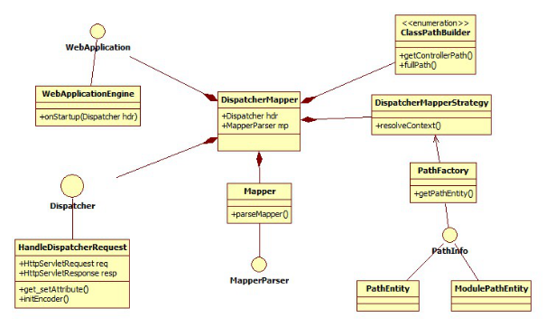

#YoioJava核心思想

:octocat:[YoioJava中文官网](http://yoiojava.com)

**摘 要**：目前Java web的框架技术已经非常成熟，但是大多数框架都比较复杂，导致学习成本偏高，市场急需一款便于学习和快速开发应用的框架。论文研究了当前主流框架技术的基础上，遵循软件敏捷开发的思想，设计并实现了一个解决表现层，业务层，持久层问题的具有快速灵活开发特性的轻量级框架。命名为YoioJava。

​	YoioJava框架基于Http Servlet开发，底层采用面向接口设计思想，实现了组件的灵活管理和框架的良好扩展特性。使用YoioJava开发WEB应用，能够有弱类型编程语言的开发体验，同时拥有Java编程语言强大的处理能力，数据模型抛弃Java传统的JavaBean,POJO(Plain Ordinary Java Object)，侧重web友好的String,key->value数据模型。

​	YoioJava框架的出现，很好的支持了企业能够快速开发应用产品的需求。同时较低的框架学习成本和快速的开发流程为企业节约了大量成本。框架具有很高的实际应用价值。

# 前言

目前Java Web的主流开发技术主要集中在Struts 2,Spring, hibernate,ibatis（已改名mybatis）,大多数企业开发都是基于SSH[1]（Structs,Spring,hibernate）或者SSI（Structs,Spring,ibatis）三大框架的整合封装开发解决方案。Spring等框架技术经过这么多年的市场验证，足以见得这些技术的成熟。企业使用这些技术整合封装出企业风格的开发规范，web开发由这些成熟的技术作为底层驱动，企业可以将精力更多的投放在具体业务的开发上面，避免了大量不可预见性的系统和安全漏洞。这种开发解决方案解决了web开发中的表现层，业务层，持久层的问题。但是各种框架侧重点不同，例如spring框架追求灵活构建项目，忽视了软件快速开发的重要性从而可能导致项目开发延期，开发成本增大等问题。还有一点是这些技术都是比较难上手的，学习成本较高。

现在使用最流行的表现层框架当属Spring MVC, Spring MVC 分离了控制器、模型对象、分派器以及处理程序对象的角色，是一款实现了完全基于MVC模式的框架。而该课题的研究，关于表现层这一块，实现类似Spring MVC的基础上，研究实现更多的常用操作，比如Request上下文动态配置，国际化全局支持，Session快捷操作等。课题研究实现了一种路由，可以根据URL请求匹配对应的控制器中的操作。

业务层流行的框架也非常多，不同的项目业务也是千变万化的，这些业务的逻辑处理需要用到各种不同的组件，面对各种组件需求，业务层领域中的Spring框架，将不同的需求组件自动实例化，开发者只要配置中配置实例的接口，就能直接使用这些实例，它的简单性、可测试性和松耦合性受到广大开发者的喜爱。

持久层框架业界主流的是Hibernate和MyBatis。Hibernate的设计是假设开发人员不会写数据库的SQL语句，通过简单的api开发人员能够很快捷的访问操作数据库。而MyBatis设计是假设开发人员都精通SQL语句的书写，主要将SQL的结果通过ORM(对象关系映射)技术将结果集生成java对象。两种框架关注点各不同，但都非常的优秀。而该课题在持久层上的研究，是找寻一种更加便捷的方式，使用该框架的Request上下文API，可以简单的输入一个数据库表名，或者一条SQL语句，都能够返回对象集。比如返回友好的数据集MAP<String>(KEY->VALUE),MAP表示java Map对象，String表示Map中的key和value都是String数据类型。这样通过业务层能够特别方便的对数据进行处理，比如调用JSON API将其转换为JSON数据。

# 1 框架的总体设计

## 1.1 框架整体架构

YoioJava框架基础为MVC结构，很好的将应用程序的逻辑层和表现层进行分离。

 

图1 YoioJava的整体架构流程图 

从图1可知，用户的Http请求会经过项目单一入口由框架Router捕获，路由通过策略模式将请求分发到对应的Controller,Controller对请求进行执行并且对请求的数据进行封装发送到Model，Model整合数据有Persistence层对数据进行持久化或者获取持久化数据发送到Controller.Controller对数据进行格式化输出或者映射到View.其中Context,Configuration,cache等是对整个过程的支持。

## 1.2 框架的基本数据模型

YoioJava是一款基于Java编程语言的Web框架，Java是一门强数据类型编程语言，所有的数据类型有着严格的类型限制，在数据交互中，经常需要进行各数据类型中的数据类型相互间的转换。而WEB类应用，所需求的数据类型其实是比较简单。所以类似php等弱类型编程语言更加贴近WEB应用数据需求，相对于Java数据能够更敏捷处理。

目前大数据所采用的储存技术使用的数据模型，例如NoSQL类成熟产品MongoDB,采用的数据储存类型BSON。BSON是一种类JSON的一种二进制形式的存储格式， {"name":"liu"} 这是一个BSON的例子，其中"name"是key name，是cstring类型，后面的"liu"是value值。MongoDB使用了BSON这种结构来存储数据和网络数据交换。

可以看出BSON数据模型对于WEB数据非常友好，也非常简单，能够满足简单，复杂，单一，集合等WEB数据需求。

目前主流的持久层框架hibernate,Mybatis都是一种ORM类框架，基于ORM的持久层框架有一个特点是对对象的需求，Java中使用最广泛的基础对象实体莫过于Javabean,POJO。ORM将数据映射为传统java实体对象，而大多数WEB应用关注点是数据本身，而并非java对象。例如WEB应用请求当前用户信息，该用户信息在数据库表user中储存。

 

图2 传统ORM框架流程

从图2可以看到ORM框架[4]将数据表映射成Java对象，在此过程中，编程人员需要对应数据库中的字段编写User的java类中各属性，也就是传统的Javabean，通过ORM将数据库数据一一映射到User对象，返回User对象，View层映射User对象，从对象中获取信息。

前面提到的这种Java对象不是WEB所关注的，所以在YoioJava中数据模型的设计更加贴近数据本身，基本数据元为key->value。也是一种类JSON储存表现格式。让数据类型变得更简单是YoioJava实现敏捷开发[5]的基础。

 

图3 YoioJava两种数据实体

图3是YoioJava的两种数据实体，数据实体1是基于Java的HashMap，数据实体2是基于Java的List。

# 2 框架的详细设计

本节详细介绍YoioJava框架的底层设计和实现。

## 2.1 Router路由器

首先介绍的是YoioJava核心组件Router路由，主要功能是对请求进行有效管理和分发映射到对应控制器。

  

图4 YoioJava Router UML模型 

图4所展示的是Router路由的具体实现模型，其中Dispatcher，MapperParser，PathInfo，WebApplication等几个接口提供具体实现组合成DispatherMapper对其进行统一管理。

Dispatcher接口具体实现具体为HandleDispatcherRequest。HandleDispatcherRequest中有一个方法initEncoder()是对请求过来的HttpServletRequest和HttpServletResponse进行初始化操作。

初始化过后的HttpServletRequest和HttpServletResponse放入到全局Request上下文RequestContext中。

PathInfo接口保存的信息主要是当前请求的模块Module，控制器Controller，动作Action。PathFactory是提供PathInfo的工厂，用来生产PathInfo实例。

Mapper是DispatcherMapper的一个内部类，实现接口MapperParser。从图5中可以看到DispatcherMapper是Router的中心，由DispatcherMapper对各部分进行统一管理。

Dispatcher组合context信息交给DispatcherMapperStrategy进行处理得到PathInfo交给ClassPathBuilder，最后将ClassPathBuilder和PathInfo交给框架应用引擎WebApplicationEngine进行应用的运行onStartup。****

WebApplication是框架应用引擎接口，不属于Router。最终的Router处理结果是由框架应用引擎来进行项目启动的。

WebApplicationEngine对应用启动，根据路由信息进行实际操作，映射到Controller。Structs 2框架通过J2EE体系中的Filter对请求进行分发，Spring MVC是通过Java反射技术对请求进行分发，YoioJava与Spring MVC一样是用反射技术对请求进行分发映射到对应Module下的Controller下的Action[6]。

 

图5 WebApplicationEngine在YoioJava中的位置

由图5可以看到，WebApplicationEngine属于框架层和应用层的一个桥接，onStartup()中捕获的异常包含属于WEB应用层异常，对于这里的异常处理机制分为下面几步处理。

\1. 对异常进行控制台输出，这里的异常有持久层（数据库）异常，表现层异常，框架异常，第一步操作对所有异常进行打印到控制台方便管理员查看异常信息。

\2. 获取配置项DEBUG，DEBUG模式下对页面输出无法找到模块，并输出异常信息到页面。运行模式下发送404 Not Found错误信息。

这样对异常处理主要目的是框架层和应用层桥接处发生的异常能够正确处理，对应用层的异常通过e.getMessage()捕获异常信息，应用层的异常可以根据配置调试模式输出到页面，这样可以不忽略异常和正确处理异常。

## 2.2 Persistence持久层

接下来介绍YoioJava核心组件Persistence持久层[7]，Persistence主要提供数据库连接池，数据库事务管理，各类型数据库驱动等服务。

 

图6 YoioJava Persistence UML模型

由图6可以看到Persistence中心提供一个PersistenceProvider接口，Database接口提供各类型数据库驱动，Transaction接口提供事务管理，DataSourceStrategy数据库连接池策略提供数据库连接。

DataSourceStrategy根据项目配置项DS_TYPE选择数据源类型，YoioJava提供数据源类型包括数据库连接池和数据库直连接两种解决方案，开发人员可以再应用项目中配置DS_TYPE来选择哪种数据库连接解决方案。连接池类型有c3p0,pooled, jndi三种，如果不使用数据库连接池可以设置为unpooled。

DataSourceStrategy提供一个静态方法getDataSource()根据配置项提供对应数据源。

DataSourceLocale是对DataSourceStrategy提供的数据源进行静态化，这样做的目的是提供Request上下文一个公用数据源，但是这样做之后就无法在不同的Action中自由切换数据源，这种实现后文会阐述。

PersistenceProvider是Persistence持久层的入口。

PersistenceProvider接口是持久层操作的接口，提供数据库Connection和数据库操作的基础方法。BasicPersistenceHandler是PersistenceProvider接口的基本实现。****

Persistence持久层Cache在YoioJava中有两种方式，一种是全局式的缓存，该种方式是在配置中配置DB_CACHE设为true,系统会对所有的select语句进行结果缓存。另一种是在Model层操作是将Model实例调用cache(true)，则该语句会进行结果缓存。

 

图7 YoioJava Persistence Cache流程图

​	由图7可以看出，Sql查询首先通过KeyGenerator使用sql语句的到一个唯一的key值，通过key在cache中查找是否存在该key的value值，如果存在，从cache中返回sql查询结果，如果不存在，则从数据库中获取sql查询结果，并将结果作为key的value缓存到cache中。

## 2.3 Configuration全局配置

YoioJava遵循一个惯例配置思想，内置了一个惯例配置文件com.yoiojava.globle.config包下的 Convention.java，里面按照常用配置对整体框架及应用进行默认配置，对应应用项目的配置文件，只需要配置和惯例配置不同的或者新增的配置参数，如果你完全采用默认配置，甚至可以不需要定义任何配置文件。惯例配置文件会被系统自动加载，无需在项目中进行加载。

Configuration提供一个通用Config接口。
````
public interface Config {

​	void C(String key, Object value);

​	Object C(String key);

​	void loadConfigFile(String file);

}
````
ConfigurationImpl为Config接口实现，全局配置的实例。

loadConfigFile(String file)根据传入后缀名加载配置文件，暂时只支持java和properties配置文件。

## 2.4 Interceptor拦截器

Interceptor拦截器[8]是YoioJava核心组件之一，同是YoioJava AOP思想的具体实现。

 

​	图8 YoioJava Interceptor 流程

​	由图8可以看到框架在进行控制器方法调用时会首先扫描这个控制器的所有方法，如果某个方法带有注解@Before，则首先执行带注解的方法，再执行调用方法。（@After是首先执行调用方法，再执行注解方法）。
````
@Retention(RetentionPolicy.RUNTIME)

@Target(ElementType.METHOD)

public @interface Before {

​	Class<?> value() default DefaultHandlerInterceptor.class;

}
````
​	注解@Before会有一个默认Interceptor，DefaultHandlerInterceptor实现接口AsyncInterceptor，是Interceptor提供的通用接口。

 

图9 YoioJava Interceptor AOP

​	图9体现的是YoioJava AOP思想。每个需要处理的Action通过注解@Before的方式将处理交给Interceptor执行。Interceptor对各Action关注点进行织入。

## 2.5 I18n国际化支持

I18n国际化支持是从框架层开始支持，基于YoioJava的应用可以很方便的集成框架的I18n特性。I18n提供一个通用接口Lang。
````
public interface Lang {

​	void L(String key, String value);

​	String L(String key);

​	void loadLangFile(String file);

}
````
框架层和应用层可以很方便的调用Lang接口，对语言进行支持。
````
public static final String DEFAULT_LANGUAGE = "ZH_CN";
````
I18n的默认配置项只有一个，配置DEFAULT_LANGUAGE系统会对使用Lang的语言进行翻译。
````
private static Lang lang = Language.getInstance();
````
获取翻译结果使用L(String key)，对请求下文进行文本翻译使用L(String key, String value)。

框架会在初始化时加载翻译信息，使用的是一种静态化方式，这样应用层能够很方便的调用I18n功能。这样设计保证了I18n的可用性和低耦合性。

## 2.6 logging日志

YoioJava的logging日志是借鉴开源持久层框架Mybatis的Ioc(控制反转)设计思想，这种思想是Log层提供统一接口Log，Log通过LogFactory获取实例。这样框架整体能够有一个统一的Log接口，在框架的任何地方或者应用层的任何地方，只需要通过：
````
private static final Log log = LogFactory.getLog(类.class);
````
获取实例进行log操作。常用的log工具有log4j,commoms log,jdbc log等，这些工具都会有一个实现Log接口的具体实现在框架中。LogFactory是实现Ioc思想的关键。

LogFactory的静态语句块中使用对框架提供的每个log工具实例进行尝试实现，尝试实现有一个优先级，根据静态语句块中的顺序。当尝试实现时会占用线程锁，只有当该尝试实现走完才会进行下一个实现，直到获取了一个有效实例。

静态语句块中最后有一个nologging，当开发这没有提供以上各log工具的jar包时，最后一种nologging是默认的logging方案，里面是空操作。

这种Logging的效果就是开发者想用哪种log工具，直接在lib中放一个该工具的jar包，在项目根目录放入log工具的配置文件，不需要自己去关注如何使用该log工具，通过框架提供的Log接口直接就可以使用该Log工具。

这种模式就是Ioc(控制反转)模式。开发这将需求交给框架，自己不必关注这些需求的具体实现使用，将具体实现任务交给框架来完成，只需要使用框架提供的接口就可以直接使用不同方案的工具。


# 3 MVC设计

## 3.1控制器

YoioJava Controller控制器依赖于Router对请求的分发。YoioJava对控制器分为三层Module(模块)，Controller(控制器)，Action(操作)。这种设计是考虑对应用层模块化开发的支持。

应用层模块化是将一个应用，分成若干个模块，每个模块独立互不干扰，由应用整体调配。模块化开发是应用模块化后，开发针对单一的模块进行实现，尽量减少对其他模块的依赖。这种模式能够有效的降低应用的耦合度，应用各组件复用性大大增强，组件移植成本低。

YoioJava通过上面的三种分层结构，使模块化开发非常方便。
````
public static final String APP_MODULE = "Yoio,UserCenter,Home";
````
通过配置app_module,给应用分模块，访问路由需要访问模块名后才能访问对应模块下的控制器。能够对模块有个标准的规格限制。能够有效对应用进行分模块。

## 3.2模型

YoioJava Model是对持久层的具体封装。

 

图10 YoioJava Model结构图

​	由图10可以看到YoioJava Model的大致实现结构。Model类继承BaseDao类，BaseDao类是由Database接口组合成，拥有Database的所有操作。通过类的继承传递Database接口的操作给Model类。

Model继承BaseDao,BaseDao有个getDatabase()方法提供数据库Database接口，Model可以通过Database接口对数据库进行操作。
````
public class BaseDao {

​	private Database db = DatabaseFactory.getDatabase();

​	public Database setTableName(String tablename) {

​		return db.setTableName(tablename);

​	}

​	protected Database getDatabase() {

​		return db;

​	}

}
````
YoioJava实现了ActiveRecord模式[9]的ORM模型,采用了非标准的ORM模型,表映射到类，类映射到YoioJava数据元。最大的特点是使用方便，以达到敏捷开发的目的。
````
public class User extends Model<User> {}
````
上面根据数据库的User表创建User类简单继承Model，User立即拥有了操作数据库的众多方法。基于ActiveRecord的Model不需要根据数据库字段定义对应java属性，不需要getter、setter方法，不需要配置。

## 3.3视图

View实体提供了View接口。
````
public interface View {

​	void assign(String alis, Object value);

​	void render();

}
````
View层根据控制器指令对模板进行渲染输出。assign(String alis, Object value)是对模板进行数据映射，模板通过${alis}对赋值的数据进行渲染输出。render()是渲染指令。控制器中的操作使用render()，View层会到WEB-INF下找到对应模板进行渲染然后输出到页面上。

# 4 框架的功能特性

YoioJava从架构设计上对框架整体特性的把握，通过架构时对框架整体低耦合、模块化、易于扩展、安全高效等特性的追求，将这些特性因素作为设计指导方案进行框架的架构考量。

## 4.1 模块化

YoioJava底层采用面向接口开发思想，各组件之间提供对外统一接口，接口实现由接口工厂通过全局配置提供接口实例。

 

图11 YoioJava底层接口模型 

​	由图11可以看到YoioJava是通过对外提供接口的方式实现框架的低耦合[10]特性。YoioJava组件模块Cache，Persistence，Logging等各自提供一个接口，每个组件相对独立，同时在一个功能上需要使用不同组件，只需要定义他们的接口，从工厂中获取实例，就可以使用这些组件，这样各组件能够高度内聚。

YoioJava模块化[11]开发旨在支持WEB应用的模块化，随着项目越来越大，Web开发中会面临越来越“重”的问题，在项目开始阶段没有规划好的话，后续再添加功能时就会变得极其麻烦，不同的功能之间非常容易产生冲突，这时就需要模块化开发来解决这些问题。

YoioJava模块化开发主要体现在Module,Controller,Action三层结构。通过Module对应用进行分层，将独立性较高的功能单独放在一个Module中进行开发，这样能够使WEB应用更加清晰，便于开发维护，同时也避免了各组件间的冲突。

## 4.2 扩展性

YoioJava底层各组件都是提供一个接口，通过接口能够很快捷的使用YoioJava的各个部分组件。YoioJava扩展只需要在对应的组件中对新的需求提供接口实例，在通用配置中修改对应配置项，就可以使用该组件。

YoioJava的高内聚低耦合支持开发者更加复杂的扩展需求。

## 4.3 安全性

YoioJava对安全性的考量分为下面几个方面：

1) 数据库层面执行sql预编译防止注入。

2) 资源层面所有模板必须放在WEB-INF目录下。

3) 数据处理层面对所有参数进行特殊字符串处理，同时对URL访问的一些系统变量做XSS处理，防止跨站脚本攻击。

## 4.4 高效性

YoioJava从架构层面对整体框架的高效性进行把握。主要从两个方面对高效性进行考虑，一方面是开发者使用YoioJava能够快速开发应用，YoioJava首先简化数据类型，使用更加贴近WEB数据需求的简单数据模型，抛弃传统POJO，大量减少开发人员的工作量，简化开发流程。然后对规范化开发追求，通过“命名优于配置”这种思想，规范开发者开发出统一规格的高质量应用。另一方面是基于YoioJava开发的应用能够分层清晰，对请求快速反应。YoioJava底层的cache提供丰富的缓存策略，View层对模板的渲染是通过IO流进行，View层使用cache方案后，大量减小了服务器的IO 开销。Persistence层的多种cache策略，最大化的减少数据库的频繁重复访问。


# 5 框架的应用开发和测试

本节会使用YoioJava开发一个简单应用，阐述使用YoioJava的开发流程。同时会使用Apache Jmeter[12]对框架进行性能测试，证明YoioJava的实用性和有效性。

## 5.1 框架系统开发	

本小节使用YoioJava框架开发一个CURD的应用系统UserAdmin来验证框架的可行性。本系统简单的实现了对用户基本信息的增、删、改、查管理。

YoioJava入口采用单一入口模式，所以首先在项目的web.xml中指定YoioJava的入口。
````
<!-- 项目统一入口 -->

​	<servlet>

​		<servlet-name>userAdmin</servlet-name>

​		<servlet-class>com.yoiojava.router.dispatcher.DefaultDispatcher</servlet-class>

​	</servlet>

​	<servlet-mapping>

​		<servlet-name>userAdmin</servlet-name>

​		<url-pattern>/Admin/*</url-pattern>

​	</servlet-mapping>


​	<!-- YoioJava默认初始化加载监听器 -->

​	<listener>

​		<listener-class>com.yoiojava.listener.LoaderListener</listener-class>

​	</listener>
````
使用Mysql数据，在数据库Yoio中创建一张yoio_users表。表结构如下表。

表1 数据库yoio_users表

| 字段       | 数据类型        | 是否为空     | 备注   |
| -------- | ----------- | -------- | ---- |
| Uuid     | Varchar(32) | NOT NULL | 用户编号 |
| Username | Varchar(30) | NOT NULL | 用户名  |
| Email    | Varchar(20) | NOT NULL | 用户邮箱 |
| Password | Varchar(32) | NOT NULL | 用户密码 |
| Status   | Char(1)     | NOT NULL | 账号状态 |

在com.application.admin.model包下根据数据库表名创建Users表的模型User.java继承类Model。
````
public class Users extends Model<Users> {}
````
在com.application.config包下创建Config.java。
````
public class Config {

​	//配置项目模块

​	public static final String APP_MODULE = "Yoio,Admin,Home"; 

​	//使用pooled数据库连接池方案

​	public static final String DS_TYPE = "pooled";

//设置默认数据库主键

​	public static final String DEFAULT_PK = "uuid";

​	// 数据库驱动

​	public static final String DB_DRIVER = "com.mysql.jdbc.Driver";

​	// 数据库类型，不需要定义

​	public static final String DB_TYPE = "mysql";

​	// 数据库服务器地址

​	public static final String DB_HOST = "localhost";

​	// 数据库名

​	public static final String DB_NAME = "yoio";

​	// 用户名

​	public static final String DB_USER = "root";

​	// 密码

​	public static final String DB_PWD = "blackhatyoio";

​	// 端口

​	public static final String DB_PORT = "3306";

​	// 数据库表前缀

​	public static final String DB_PREFIX = "yoio_";

}
````
这样系统的配置项就配置好了，主要是配置注册Admin模块和数据库连接池策略和数据库连接信息。

在com.application.admin.controller包下创建UserAdminController.java。
````
public class UserAdminController extends Controller {

​	/**
​	 * 获取所有用户
​	 * 
​	 * @author Yoio<Yoio@3cto.net>
​	 */

​	public void listUser() {

​		// 使用Users Model实例

​		Users user = new Users();

​		show(JSON.toJSONString(user.cache(true).where("status='1'").select()));

​	}

​	/**
​	 * 新增一个用户
​	 * 
​	 * @author Yoio<Yoio@3cto.net>
​	 */

​	public void addUser() {

​		Users user = new Users();

​		user.set("uuid", ParameterKit.uuid());

​		user.set("username", "Yoio" + Math.round(Math.random() * 10000000));

​		user.set("password", new Md5().getMD5ofStr("1111"));

​		user.set("email", "yoio@3cto.net");

​		user.set("status", 1);

​		user.add();

​	}

​	/**
​	 * 根据编号删除一个用户
​	 * @author Yoio<Yoio@3cto.net>
​	 */

​	public void delUser() {

​		Users user = new Users();

​		// 删除GET[id]的用户信息

​		user.delete(I("id"));

​	}

​	/**
​	 * 更新用户信息
​	 * 
​	 * @author Yoio<Yoio@3cto.net>
​	 */

​	public void saveUser() {

​		Users user = new Users();

​		// 更新GET[id]的用户信息email为yoiojava8@gmail.com

​		user.where("uuid=?").addParameter(I("id"));

​		user.set("email", "yoiojava8@gmail.com");

​		user.save();

​	}

}
````
完成上面Controller的开发后，该应用系统基本上就开发完成了。

从上面可以看出，代码编写很少，结构清晰，配置简单，只是配置数据库连接相关参数。很快就完成了一个应用开发。

## 5.2 框架综合测试

YoioJava框架的测试主要分为两部分：功能的测试和性能的测试。该测试基于上面

的 UserAdmin系统，并通过 Web 测试工具 JMeter 模拟并发请求来测试 YoioJava框架的整体性能。

本小节对YoioJava进行定量测试。使用Apache Jmeter工具模拟并发请求来测试YoioJava框架的性能和功能。****

为检测系统在多用户，大数据量请求下系统能够正常持续运行。测试用例使用多个不同请求并发请求服务器。

 

图12 YoioJava 性能测试结果

根据图12上数据结果表明，整个系统运行稳定，没有出现报错和中断；平均响应时间(average)增长并不显著，系统性能良好。****

系统功能测试主要测试系统各项功能是否正常运行，以及在运行期间是否会发生内存泄露等严重事故。

本次测试采用三组线程组，线程组1和3都使用2个线程，每个线程发送20000个请求，下图是测试结果图。

 

图13 YoioJava 并发功能测试结果

从图13测试结果中可知，请求过程中并没有发生系统错误，请求操作全部成功执行，而且请求操作时间也一直非常稳定，大约保持在 1ms 左右。测试期间，系统内存占用一直平稳状态，无内存溢出现象。

# 总结

目前市场主流的Java Web的开发解决方案是应用SSH集成框架。使用这样的技术开发WEB应用需要对集成框架系统学习，面临一个学习成本偏高的问题。该框架的设计简化了传统Java开发流程，设计了多种快捷API，体现了简洁的编程风格，一定程度上解决了学习成本高的问题。相对于SSH的开发流程，该框架更加的轻量，所以使用该框架开发更加快速简单。

该框架实现了MVC结构的框架架构思想，实现了组件的灵活管理和框架的良好扩展特性。框架结合了当前流行的AOP(面向方面编程，Aspect Oriented Progaming)和IoC(控制反转，Inversion of Control)轻量级框架解决方案，同时采用JAVA反射机制，对AOP功能进行简单实现。最终框架还解决了项目繁琐的XML组件配置问题，实现了快速灵活的动态配置。​
